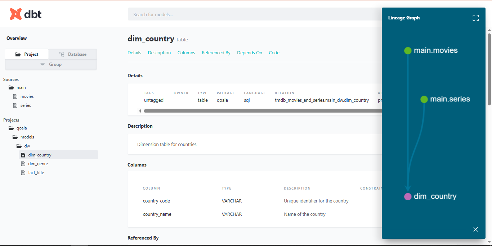

# Data Pipeline Documentation: Qoala Test Data Architecture


## Overview 

This pipeline demonstrates an end-to-end DataOps architecture for testing and prototyping using open-source tools:
- **Source**: Kaggle dataset
- **Processing & Modelling**: Raw -> Star Schema -> Analytics-ready
- **Toolchain**: Apache Airflow, DBT, Docker

## Data Pipeline Construction

### Components and Roles : 
1. **Kaggle**: External Data Sources
2. **Airflow**: Orchestrates each task in the pipeline
3. **DBT**: Perform SQL-based transformation logic
4. **Docker**: Provides a portable runtime environment
5. **Star Schema**: Centralized data for analytical queries

### Step-by-step Flow

1. Data Extraction

Tools : using `kagglehub` from `PyPI`

Logic:
```bash
import kagglehub
dataset_path: str = kagglehub.dataset_download(self.dataset)
```

Output: `.json` files stored locally `raw/datasets`

2. Raw Data Loading

Load the data into DuckDB as raw tables. The entire pipeline managed with Apache Airflow tasks (`LoadOperator`) and pandas for the transformation. The schema also inferred from the data sources.

3. Transformation into Star Schema

Transformation has been done using `DBT` and we got Data Lienage & Data Catalog



4. Orchestration via Apache Airflow

The end to end process orchestrate by Apache Airflow

5. Data Modelling (Analytics Ready)

The data is already serve to consume by the analytics team for :
- Data Mart
- Reporting
- ML

### Instruction to Run and Maintain the Pipeline
1. Setup Instructions
    - **Clone the Repo**
    ```bash
    git clone https://github.com/haydarmiezanie/qoala.git
    cd qoala
    ```
    - **Star Docker Service**
    ```bash
    docker compose up -d
    ```
    This spins up Airflow, DBT, Database
    - **Access Airflow UI**
    Navigate to `http://localhost:8080`

2. Maintenance Guideliens
- Update Schema: Modify DBT files
- Debug Pipeline: Check airflow logs
- Test Transformations: use `dbt tests`

### Process Documentation & Design Decisions
Why This Stack ?
- Because `DuckDB` is opensource OLAP and fast local storage
- `DBT` because it's provide not only templating but also data catalog, data lineage, and data quality in one platform
- `Airflow` is reliable DAG-based orchestrator
- `Docker` is isolated enironment for testing

My Pipeline Characteristics:
- Modular can plug any other data source with minimal changes
- low-cost because the entire system built in opensources
- scalable can be scaled to cloud with minimal changes

## Optional Enhancements
- Add `Superset/Grafana` For Visualization tools and Infrastructure Monitoring
- Add `Data Quality` checks to makesure the entire process met with the users expectations
- Add `Scheduler` because right now it's trigger based
- Add `CI/CD Integration` to make every process connected and integrated 